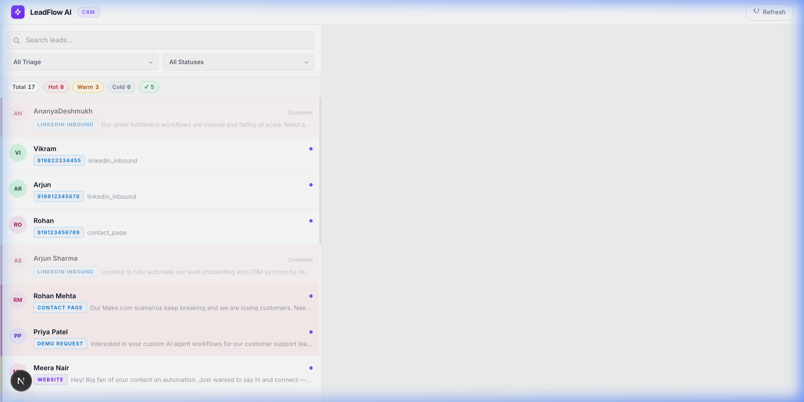
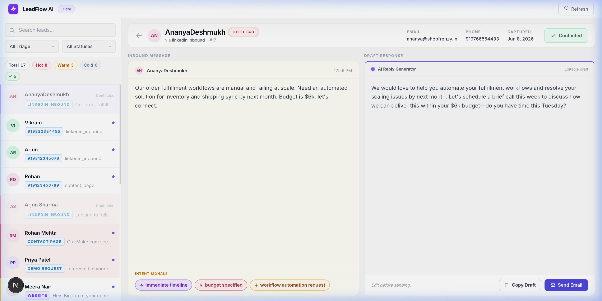

# ⚡ LeadFlow AI — Inbound Lead Automation & CRM System

LeadFlow AI is an intelligent local lead management system and classification dashboard. It automates capturing inbound leads (via Google Sheets, Forms, Webhooks, or CSVs), classifies their sales intent using state-of-the-art LLMs (Gemini & Claude), extracts key intent signals, drafts personalized responses, and provides an elegant single-page CRM dashboard to manage, edit, and send emails directly to the prospects.

---

## 📸 Dashboard Preview

### 1. Main CRM Dashboard Overview
The dashboard features real-time search, filters for triage categories and contact status, key metric stat cards, and an interactive list view of active leads.



### 2. Lead Detail & AI Response Panel
Selecting a lead splits the screen to show the full inbound message, extracted intent signals (badges), and an editable draft response prepared by the AI, ready to be sent via the SMTP integration.



---

## 🏗️ Architecture & Data Flow

```text
  ┌────────────────────────────────────────────────────────┐
  │                   Inbound Lead Sources                 │
  │  (Google Sheets, Webhook, Google Form, raw CSV, etc.)  │
  └───────────────────────────┬────────────────────────────┘
                              │
                              │ 1. New lead entries
                              ▼
  ┌────────────────────────────────────────────────────────┐
  │              n8n Local Automation Flow                 │
  │     (Parses spreadsheet data & POSTs to /lead)         │
  └───────────────────────────┬────────────────────────────┘
                              │
                              │ 2. HTTP POST /lead
                              ▼
  ┌────────────────────────────────────────────────────────┐
  │                 Python FastAPI Backend                 │
  │     - Route /lead receives data                        │
  │     - Calls LLM client for categorization              │
  │     - Writes to SQLite local database (leads.db)       │
  └──────┬────────────────────┬────────────────────▲───────┘
         │                    │                    │
         │ 3. Call LLM API    │ 4. Return JSON     │ 5. GET /leads (fetch list)
         ▼                    ▼                    │    PATCH /leads/{id} (status)
  ┌──────────────┐    ┌──────────────┐             │    POST /send-email (SMTP)
  │  Gemini API  │    │ Claude API   │             │
  │ (Preferred)  │    │  (Fallback)  │             │
  └──────────────┘    └──────────────┘             │
                                                   │
  ┌────────────────────────────────────────────────▼────────┐
  │               Next.js React Dashboard UI                │
  │  - Color-coded lead status (Hot, Warm, Cold)           │
  │  - Real-time search & filters                          │
  │  - Single-click Copy Draft or Send Email               │
  │  - Toggle "Mark as Contacted"                          │
  └─────────────────────────────────────────────────────────┘
```

---

## 📂 Codebase Explanation & File Structure

Here is a breakdown of the core files in this project:

```text
├── backend
│   ├── app
│   │   ├── main.py        # FastAPI server entry point, routes, CORS & SMTP setup
│   │   ├── database.py    # Thread-safe local JSON database store with atomic writes
│   │   ├── llm.py         # Multi-provider LLM connector (Gemini/Claude) & classification logic
│   │   └── schemas.py     # Pydantic models for data validation
│   ├── sync_leads.py      # Google Sheets CSV polling & ingestion script
│   └── requirements.txt   # Python dependency declarations
├── frontend
│   ├── src
│   │   └── app
│   │       ├── page.tsx   # React Dashboard UI (State, API interactions, styling)
│   │       └── layout.tsx # Core layout & metadata configurations
└── workflows
    └── n8n_workflow.json  # Importable local n8n automation workflow
```

### 1. Backend Service (`backend/app`)

*   **[`main.py`](file:///Users/shashank/Automation%20Project/backend/app/main.py)**: Built with FastAPI. It handles CORS middleware so the Next.js frontend can interact with it. Key endpoints include:
    *   `POST /lead`: Ingests leads, queries the LLM for intent classification/response drafting, and saves to the database. It utilizes deduplication to avoid redundant LLM calls if the same lead resubmits.
    *   `GET /leads`: Fetches all leads from the JSON store sorted newest-first.
    *   `PATCH /leads/{lead_id}`: Toggles a lead's status between `"New"` and `"Contacted"`.
    *   `POST /send-email`: Integrates with Gmail's SMTP server via STARTTLS to send the customized AI draft directly to the prospect's email, wrapping the text in a clean HTML card.
*   **[`database.py`](file:///Users/shashank/Automation%20Project/backend/app/database.py)**: Manages local data persistence inside `leads.json`. To prevent corruption during concurrent requests:
    *   It uses a `threading.Lock()` to synchronize access.
    *   It writes data atomically using a temporary file (`leads.json.tmp`) and swaps it into place (`os.replace`).
*   **[`llm.py`](file:///Users/shashank/Automation%20Project/backend/app/llm.py)**: Standardizes communication with Gemini and Anthropic Claude APIs. 
    *   It sends system instructions directing the model to analyze inbound leads and return structured JSON containing the classification (`Hot`, `Warm`, or `Cold`), the response reply, and an array of `signals` (e.g. `["pricing inquiry", "demo request"]`).
    *   Features exponential backoff logic (up to 5 retries) to handle API rate limits (`429` / `RESOURCE_EXHAUSTED`).
    *   Safely extracts JSON from model responses using a string search for brackets `{}` in case the model wraps JSON inside markdown code blocks.
*   **[`schemas.py`](file:///Users/shashank/Automation%20Project/backend/app/schemas.py)**: Defines Pydantic data schemas to validate request inputs and format JSON responses.

### 2. Synchronization Script (`backend/sync_leads.py`)
*   **[`sync_leads.py`](file:///Users/shashank/Automation%20Project/backend/sync_leads.py)**: A standalone script to seed/sync the database with leads from a live Google Sheet. It parses spreadsheet data, processes split-name columns, checks the database for existing records, and sends new leads to the LLM backend for processing.

### 3. Frontend Dashboard (`frontend/src/app`)
*   **[`page.tsx`](file:///Users/shashank/Automation%20Project/frontend/src/app/page.tsx)**: The single-page dashboard built with React and Tailwind CSS.
    *   **Dynamic Stats Bar**: Computes and shows metrics (Total, Hot, Warm, Cold, and Contacted).
    *   **Search & Filtering**: Immediate client-side matching across names, emails, and message text, plus category filters.
    *   **Detail Panel**: Displays message detail, color-coded avatar initials based on character hashes, and extracted signal pills.
    *   **Draft Editor & Actions**: Integrates a responsive textarea to modify the AI draft, with quick buttons to copy to the clipboard or trigger the SMTP backend to send an email immediately.

---

## ⚡ Quick Start

### 📋 Prerequisites
*   Python 3.10+
*   Node.js 18+
*   Gmail account (with an App Password enabled if using the SMTP feature)
*   Gemini API Key

---

### Step 1: Configure Environment Variables

Create a `.env` file inside the `backend` folder:

```env
# backend/.env
GEMINI_API_KEY="your_gemini_api_key"
GMAIL_ADDRESS="your_gmail_username@gmail.com"
GMAIL_APP_PASSWORD="your_gmail_app_password" # 16-character code from Gmail Security
```

---

### Step 2: Start the Python Backend

1. Navigate to the backend directory:
   ```bash
   cd backend
   ```
2. Set up and activate a virtual environment:
   ```bash
   python3 -m venv venv
   source venv/bin/activate
   ```
3. Install dependencies:
   ```bash
   pip install -r requirements.txt
   ```
4. Start the FastAPI development server:
   ```bash
   uvicorn app.main:app --reload
   ```
   The backend will be running at [http://localhost:8000](http://localhost:8000) and the API documentation is available at [http://localhost:8000/docs](http://localhost:8000/docs).

---

### Step 3: Seed & Sync Google Sheet Data

Keep the backend server running. In a new terminal window, run the sync script to pull mock leads from Google Sheets:
```bash
cd backend
source venv/bin/activate
python sync_leads.py
```

---

### Step 4: Start the Frontend UI

1. Navigate to the frontend directory:
   ```bash
   cd frontend
   ```
2. Install npm dependencies:
   ```bash
   npm install
   ```
3. Launch the Next.js development server:
   ```bash
   npm run dev
   ```
4. Open [http://localhost:3000](http://localhost:3000) in your browser to access the dashboard.

---

### Step 5: Setup n8n Automations (Optional)

1. Start your local n8n instance:
   ```bash
   npx n8n start
   ```
2. Access the n8n interface (`http://localhost:5678`), go to **Workflows > Import from File**, and load [`workflows/n8n_workflow.json`](file:///Users/shashank/Automation%20Project/workflows/n8n_workflow.json).
3. Connect your triggers (Google Forms/Sheets/Webhooks) and activate the workflow to automatically forward incoming leads to `http://localhost:8000/lead`.

---

## 🛠️ Libraries & Technologies Used

### Backend
*   **FastAPI**: Modern, fast web framework for building APIs with Python.
*   **google-genai**: Official SDK for integrating Google's Gemini models.
*   **python-dotenv**: Loads environment configurations from `.env`.
*   **smtplib & email**: Standard Python libraries to format and securely transmit HTML emails.

### Frontend
*   **Next.js**: React framework for high-performance server-side rendering and routing.
*   **Tailwind CSS**: Utility-first CSS framework for clean, responsive designs.
*   **React Hooks**: Employs `useState`, `useEffect`, and `useCallback` to handle API interactions and component state.
